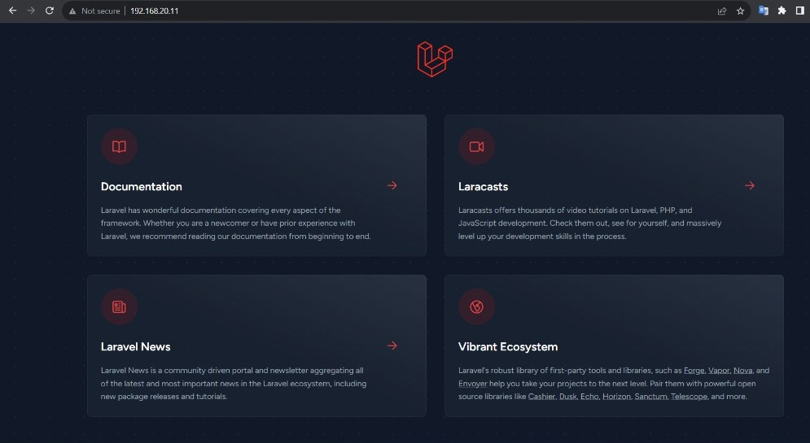

# # Project Documentation: Automated Deployment of LAMP Stack with Vagrant and Ansible

**GitHub Repository for PHP Laravel Application:** [GitHub Repo](https://github.com/laravel/laravel)

## Prerequisites

Before starting this project, make sure you have the following prerequisites:

- [Vagrant](https://www.vagrantup.com/) installed on your local machine.
- [VirtualBox](https://www.virtualbox.org/) or another supported provider for Vagrant.
- Basic knowledge of Vagrant and Ansible.
- The PHP application code you want to deploy, available in a GitHub repository.

## Objective

The main objective of this project is to automate the provisioning of two Ubuntu-based servers, "Master" and "Slave," using Vagrant. Specifically, we aim to achieve the following:

1. Create a bash script to automate the deployment of a LAMP (Linux, Apache, MySQL, PHP) stack on the Master node.

2. This bash script should perform the following tasks:
   - Clone a PHP application from GitHub.
   - Install all necessary packages for the LAMP stack.
   - Configure the Apache web server and MySQL.
   - Ensure the bash script is reusable and readable for future use.

3. Utilize an Ansible playbook to execute the bash script on the Slave node.

4. Verify that the PHP application is accessible through the VM's IP address, and document this accessibility as evidence.

5. Create a cron job to check the server's uptime every day at 12 am.

## Project Components

This project comprises the following components:

1. **Vagrant**: Used to automate the setup of virtual machines for "Master" and "Slave" nodes.

2. **Bash Script**: Responsible for the automated deployment of the LAMP stack on the "Master" node.

3. **Ansible Playbook**: Used to execute the bash script on the "Slave" node and ensure a consistent configuration.

4. **GitHub Repository**: The PHP application source code is hosted on GitHub and will be cloned during deployment.

## How to Use This Project

1. Clone this repository to your local environment.

2. Install Vagrant and Ansible on your local machine.

3. Use Vagrant to provision two virtual machines, naming one "Master" and the other "Slave."

4. Run the bash script on the "Master" node to deploy the LAMP stack.

5. Use the Ansible playbook to execute the bash script on the "Slave" node.

6. Verify that the PHP application is accessible through the VM's IP address. 

7. Set up a cron job on the "Slave" node to check the server's uptime every day at 12 am.

## Additional Notes

- Remember to tailor the configurations and scripts to your specific requirements and environment.

- Make sure to have a valid SSH key for secure access to your virtual machines.

This project aims to provide a structured and automated way to set up a LAMP stack for development and testing purposes. It encourages best practices in automation and documentation.

